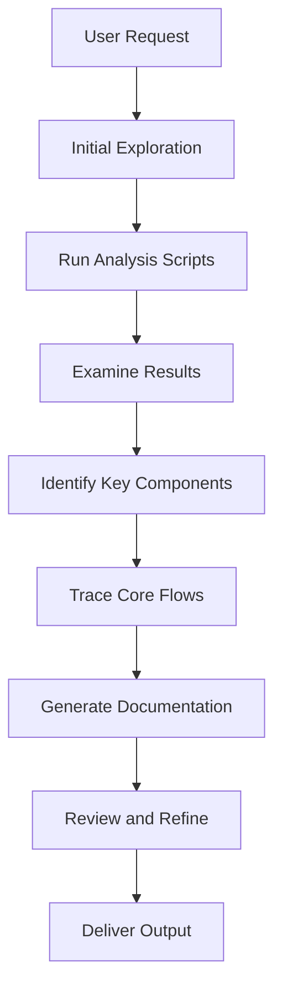

# Codebase Explorer

Systematically analyze codebases to generate comprehensive documentation with visual diagrams.

## Overview

This skill enables rapid codebase understanding through automated analysis and structured documentation generation. It produces detailed project documentation including technology stack detection, directory structure visualization, flow diagrams, and architectural insights.

## Analysis Workflow

Follow this sequential workflow to analyze a codebase:



## Step 1: Initial Exploration

Quickly assess the project to understand its nature:

1. Check for README files in project root
2. Identify package manager (package.json, requirements.txt, go.mod, etc.)
3. Note primary programming language(s)
4. Locate configuration files

**Time**: 2-5 minutes

## Step 2: Run Analysis Scripts

Execute the three analysis scripts in order:

### 2.1 Analyze Project Structure
```bash
python3 .claude/skills/codebase-explorer/scripts/analyze_structure.py [project_path] --max-depth 3
```

Outputs:
- ASCII directory tree
- File statistics (counts, line counts)
- Mermaid tree diagram
- JSON structure data (`.codebase-structure.json`)

### 2.2 Detect Technology Stack
```bash
python3 .claude/skills/codebase-explorer/scripts/detect_tech_stack.py [project_path]
```

Outputs:
- Package manager identification
- Languages with file counts
- Frameworks and libraries
- Build tools
- Top 20 dependencies
- JSON data (`.codebase-tech-stack.json`)

### 2.3 Find Entry Points
```bash
python3 .claude/skills/codebase-explorer/scripts/find_entry_points.py [project_path]
```

Outputs:
- Entry point files (main.py, index.js, etc.)
- Configuration files
- Route definitions
- API endpoints (first 20 detected)
- JSON data (`.codebase-entry-points.json`)

**Time**: 1-3 minutes total

## Step 3: Examine Results

Review script outputs to understand the technical landscape:

1. **Structure**: Identify key directories and their purposes
2. **Tech Stack**: Note main technologies, frameworks, and dependencies
3. **Entry Points**: Locate application entry, routes, and configuration files

**Extract This Information**:
- Project type (web app, library, CLI tool, etc.)
- Architecture pattern (MVC, microservices, monolith, etc.)
- Main modules and their responsibilities
- External dependencies and integrations

**Time**: 3-5 minutes

## Step 4: Identify Key Components

Map out the main building blocks:

### Entry Points
- Main application entry file
- Route definition files
- Configuration files
- API endpoint definitions

### Core Modules
- Business logic modules
- Data access layers
- Utility/helper functions
- UI components (for frontend projects)

### Data Flow
- Where data enters the system
- How data is processed
- Where data is stored
- How data is returned

**Time**: 5-10 minutes

## Step 5: Trace Core Flows

Understand how the application works by reading key files:

### Common Flows to Trace

**Application Startup Flow**:
1. Entry point loads
2. Configuration is read
3. Dependencies are initialized
4. Server/listeners start
5. Application is ready

**Request/Response Flow**:
1. Request enters at entry point
2. Routing determines handler
3. Middleware processes request
4. Controller/action executes
5. Business logic runs
6. Data is retrieved/stored
7. Response is generated
8. Response is returned

**Data Flow**:
1. Input validation
2. Processing/transformation
3. Business rules application
4. Persistence
5. Output formatting

**Actions**:
- Read key files identified in Step 4
- Follow function calls and imports
- Map the execution path
- Note important decisions and branches
- Identify error handling

**Time**: 10-20 minutes (depends on complexity)

## Step 6: Generate Documentation

Create comprehensive documentation using the template:

1. Load `references/doc_template.md`
2. Fill all sections with gathered information
3. Generate Mermaid diagrams for visual clarity
4. Replace all placeholders

### Required Sections

1. **Project Overview** - High-level description with main features
2. **Tech Stack Analysis** - Languages, frameworks, build tools, dependencies
3. **Project Structure** - Directory layout with Mermaid tree diagram
4. **Core Flows** - Mermaid flowcharts and sequence diagrams
5. **Module Dependencies** - Mermaid dependency graph
6. **Key Files** - Important files with descriptions
7. **Architecture Analysis** - Patterns, design characteristics
8. **Recommendations** - Improvement suggestions

**Time**: 10-15 minutes

## Step 7: Review and Refine

Ensure accuracy and completeness:

- [ ] All placeholder text replaced
- [ ] Mermaid diagrams render correctly
- [ ] File paths are accurate
- [ ] Technology versions are correct
- [ ] Flow descriptions are clear
- [ ] Recommendations are actionable
- [ ] No technical errors or assumptions

**Time**: 3-5 minutes

## Analysis Dimensions

### 1. Project Structure
Analyze directory organization, file placement, and module boundaries.

**Output**: Mermaid tree diagram, directory descriptions

### 2. Technology Stack
Identify languages, frameworks, libraries, and tools.

**Output**: Tech stack tables, dependency lists

### 3. Code Flows
Trace execution paths, data flow, and request/response cycles.

**Output**: Mermaid flowcharts, sequence diagrams

### 4. Dependencies
Map module relationships and external integrations.

**Output**: Mermaid dependency graph, integration lists

### 5. Architecture Patterns
Identify design patterns and architectural style.

**Output**: Pattern descriptions, architecture notes

## Project Type Strategies

### Web Applications (Full Stack)
**Focus**: API endpoints, frontend/backend integration, database models, authentication

**Key Files**: Route definitions, API handlers, database models, frontend components

### Frontend Projects (React/Vue/etc.)
**Focus**: Component hierarchy, state management, routing, API integration

**Key Files**: Root component, route configuration, state store, main entry point

### Backend Services
**Focus**: API design, business logic, data access, middleware

**Key Files**: Application entry, API routes, services, models/repositories

### Libraries / SDKs
**Focus**: Public API surface, internal architecture, dependencies, usage examples

**Key Files**: Package entry points, public API definitions, core implementation

### CLI Tools
**Focus**: Command definitions, argument parsing, execution flow, configuration

**Key Files**: CLI entry point, command definitions, main application logic

## Resources

### scripts/

**analyze_structure.py**: Generates directory tree, file statistics, and Mermaid diagram

**detect_tech_stack.py**: Identifies programming languages, frameworks, and dependencies

**find_entry_points.py**: Locates entry points, configuration files, and route definitions

### references/

**doc_template.md**: Complete documentation template with all required sections

**tech_stack_patterns.md**: Reference guide for identifying technology stacks

**mermaid_guide.md**: Mermaid diagram syntax and best practices

**workflow_guide.md**: Detailed step-by-step workflow with troubleshooting

## Time Estimates

| Project Size | Analysis Time | Documentation Time | Total |
|-------------|--------------|-------------------|-------|
| Small (< 100 files) | 10-15 min | 10-15 min | 20-30 min |
| Medium (100-500 files) | 20-30 min | 15-20 min | 35-50 min |
| Large (500+ files) | 30-60 min | 20-30 min | 50-90 min |

## Best Practices

1. **Start Simple**: Begin with quick overview, then dive deeper
2. **Use Scripts**: Let automation handle data collection
3. **Focus on Essentials**: Document key components, not every file
4. **Visualize**: Use Mermaid diagrams to make complex flows clear
5. **Be Specific**: Use actual file paths and function names
6. **Note Assumptions**: Clearly mark when inferring information
7. **Provide Context**: Explain why certain decisions were made
8. **Keep It Readable**: Use clear language and good formatting

## Output Checklist

Before delivering documentation, ensure:

- [ ] Project overview is clear and accurate
- [ ] Tech stack is complete with versions
- [ ] Directory structure is visualized with Mermaid
- [ ] Core flows are documented with diagrams
- [ ] Key files are listed with descriptions
- [ ] Architecture patterns are identified
- [ ] Recommendations are provided
- [ ] All Mermaid diagrams are valid
- [ ] File paths are correct
- [ ] No placeholder text remains
