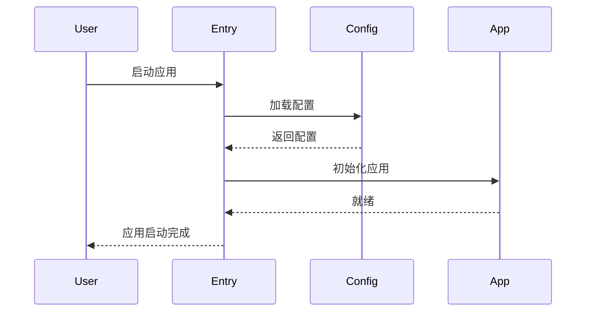
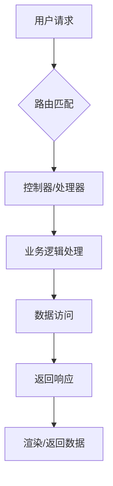
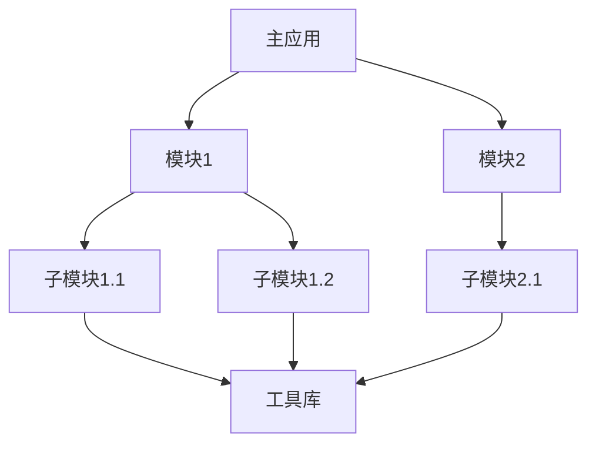

# Codebase Analysis Documentation Template

Use this template when generating project analysis documentation. Copy and adapt based on the specific project characteristics.

---

# [PROJECT_NAME] 项目解读文档

> 生成时间: [DATE]
> 分析路径: [PROJECT_PATH]

---

## 📋 项目概览

### 项目简介
[简要描述项目的主要功能和目的。根据项目名称、README（如果存在）和代码结构推断。]

### 主要功能
- [功能 1]: [描述]
- [功能 2]: [描述]
- [功能 3]: [描述]

### 技术栈总结
| 类别 | 技术 |
|-----|------|
| 编程语言 | [主要语言] |
| 主要框架 | [框架名称] |
| 包管理器 | [npm/pip/go modules等] |
| 构建工具 | [webpack/vite/gradle等] |

---

## 🔧 技术栈分析

### 编程语言
| 语言 | 文件数 | 说明 |
|-----|-------|------|
| [语言1] | [数量] | [主要用途] |
| [语言2] | [数量] | [主要用途] |

### 框架和库
| 类型 | 名称 | 用途 |
|-----|------|------|
| 前端框架 | [React/Vue等] | UI框架 |
| 后端框架 | [Express/Django等] | 服务器框架 |
| UI组件库 | [Material-UI/Ant Design等] | UI组件 |
| 工具库 | [lodash/moment等] | 工具函数 |

### 构建工具
- [构建工具1]: [用途]
- [构建工具2]: [用途]

### 依赖管理
**包管理器**: [npm/yarn/pip等]

**主要依赖** (前20个):
- [依赖1]: [版本]
- [依赖2]: [版本]
---

## 📁 项目结构

```mermaid
graph TD
[在此处插入 Mermaid 目录树，由 analyze_structure.py 生成]
```

### 目录说明
| 目录 | 说明 |
|-----|------|
| `[目录名]` | [用途说明] |
| `[目录名]` | [用途说明] |

### 主要模块介绍
1. **[模块1名称]**
   - 位置: `[路径]`
   - 功能: [功能描述]
   - 关键文件: `[文件列表]`

2. **[模块2名称]**
   - 位置: `[路径]`
   - 功能: [功能描述]
   - 关键文件: `[文件列表]`

---

## 🔄 核心链路流程

### 应用启动流程


### 主要业务流程


### 数据流转路径


#### 流程说明
1. **[流程阶段1]**
   - 入口: `[文件路径]`
   - 处理逻辑: [描述]
   - 输出: [描述]

2. **[流程阶段2]**
   - 入口: `[文件路径]`
   - 处理逻辑: [描述]
   - 输出: [描述]

---

## 🔗 模块依赖关系



### 模块间调用关系
| 调用者 | 被调用者 | 调用方式 | 说明 |
|-------|---------|---------|------|
| `[模块A]` | `[模块B]` | [导入/注入/HTTP] | [说明] |
| `[模块A]` | `[模块C]` | [导入/注入/HTTP] | [说明] |

### 外部依赖
| 依赖名称 | 用途 | 调用位置 |
|---------|------|---------|
| `[外部API]` | [功能] | `[文件路径]` |
| `[数据库]` | [数据存储] | `[配置位置]` |

---

## 📄 关键文件清单

| 文件路径 | 功能说明 | 重要性 |
|---------|---------|-------|
| `[路径]` | [说明] | ⭐⭐⭐ |
| `[路径]` | [说明] | ⭐⭐ |
| `[路径]` | [说明] | ⭐ |

### 核心入口文件
- **主入口**: `[路径]` - [说明]
- **路由定义**: `[路径]` - [说明]
- **配置文件**: `[路径]` - [说明]

### 重要业务文件
- **业务逻辑**: `[路径]` - [说明]
- **数据模型**: `[路径]` - [说明]
- **工具函数**: `[路径]` - [说明]

---

## 🎯 项目特点与建议

### 架构特点
1. **[特点1]**
   - 描述: [详细说明]
   - 优势: [说明]
   - 示例: [代码示例或引用]

2. **[特点2]**
   - 描述: [详细说明]
   - 优势: [说明]
   - 示例: [代码示例或引用]

### 设计模式
- [模式1]: [应用场景]
- [模式2]: [应用场景]

### 代码组织
- [组织方式]: [说明]
- [分层结构]: [说明]

---

## 💡 潜在改进点

### 代码质量
1. **[问题1]**
   - 位置: `[文件路径]`
   - 问题描述: [详细描述]
   - 改进建议: [具体建议]

2. **[问题2]**
   - 位置: `[文件路径]`
   - 问题描述: [详细描述]
   - 改进建议: [具体建议]

### 架构优化
1. **[优化点1]**
   - 当前状态: [描述]
   - 优化建议: [具体建议]
   - 预期收益: [说明]

2. **[优化点2]**
   - 当前状态: [描述]
   - 优化建议: [具体建议]
   - 预期收益: [说明]

### 性能优化
- [优化项]: [建议]

### 安全性
- [安全建议]: [说明]

---

## 📊 项目统计

| 指标 | 数值 |
|-----|------|
| 总文件数 | [数量] |
| 代码文件数 | [数量] |
| 代码行数 | [数量] |
| 目录数 | [数量] |
| 主要语言 | [语言] |

---

## 🚀 快速开始

### 环境要求
- [要求1]
- [要求2]

### 安装依赖
```bash
[安装命令]
```

### 运行项目
```bash
[启动命令]
```

### 构建项目
```bash
[构建命令]
```

---

## 📝 备注

- [其他重要信息]
- [特殊配置说明]
- [已知问题]

---

**文档生成**: Codebase Explorer Skill
**分析深度**: [quick/medium/very thorough]
