# Mermaid Chart Guide

Quick reference for creating Mermaid diagrams in codebase documentation.

---

## Table of Contents
- [Flowchart](#flowchart)
- [Sequence Diagram](#sequence-diagram)
- [Graph (Tree) Diagram](#graph-tree-diagram)
- [Class Diagram](#class-diagram)
- [State Diagram](#state-diagram)
- [Best Practices](#best-practices)

---

## Flowchart

Use for: Process flows, decision trees, data flow, algorithm visualization

### Syntax

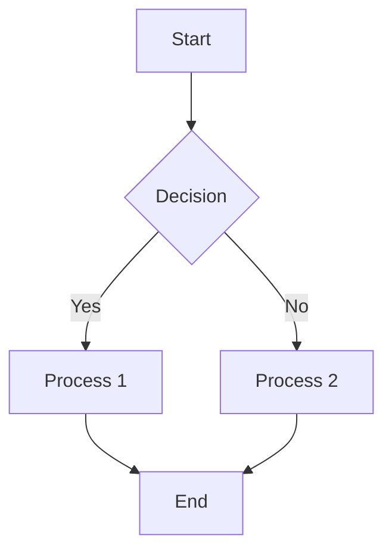

### Direction Options
- `TD` - Top to Down (default)
- `LR` - Left to Right
- `BT` - Bottom to Top
- `RL` - Right to Left

### Node Shapes
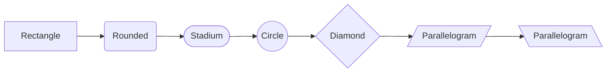

### Styling
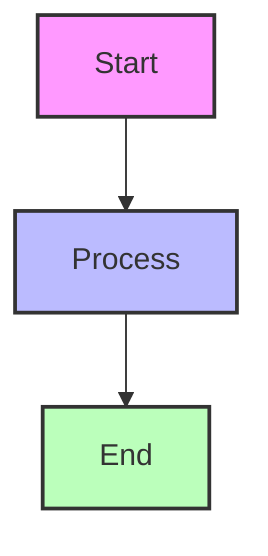

### Subgraphs
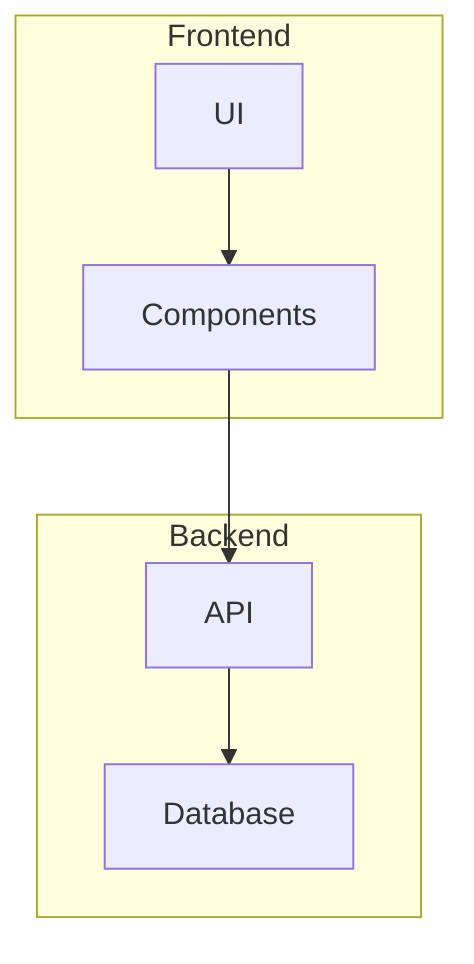

---

## Sequence Diagram

Use for: API calls, function invocations, interaction sequences, request/response flows

### Syntax

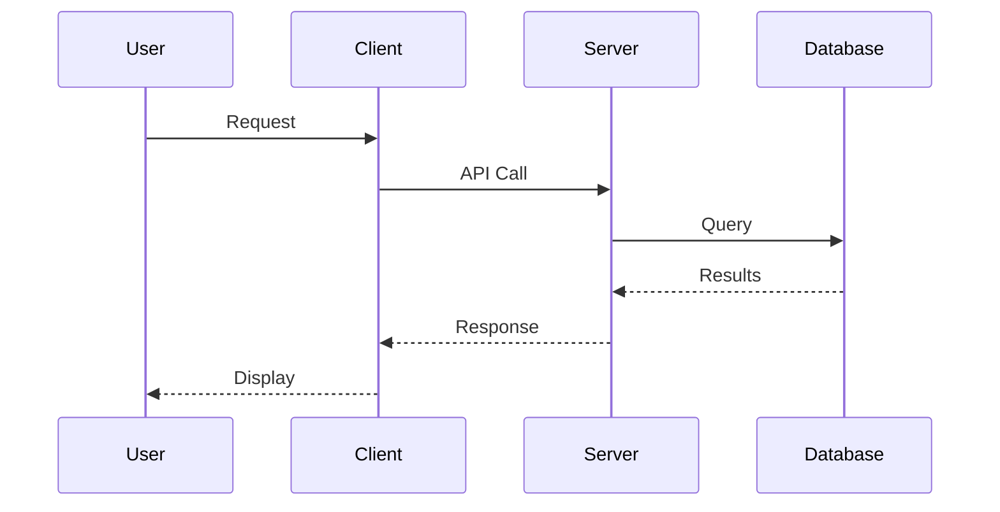

### Message Types
- `->>` Synchronous message (solid line)
- `-->>` Return message (dotted line)
- `->` Asynchronous message (open arrow)
- `-->` Async return message

### Loops and Conditions
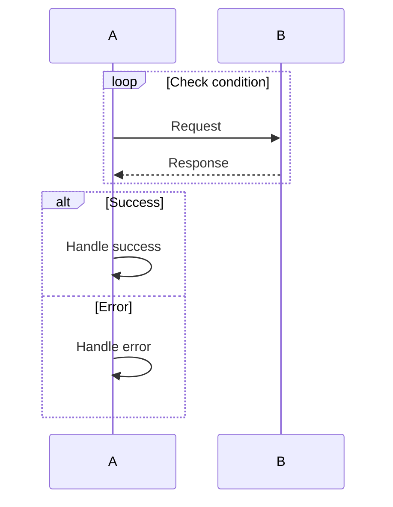

### Activations
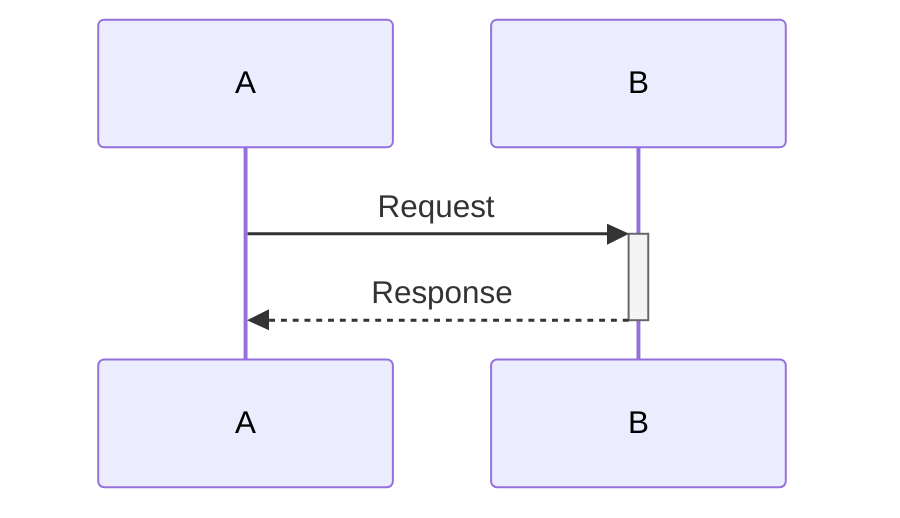

---

## Graph (Tree) Diagram

Use for: Directory structures, hierarchies, organization charts, dependency trees

### Syntax

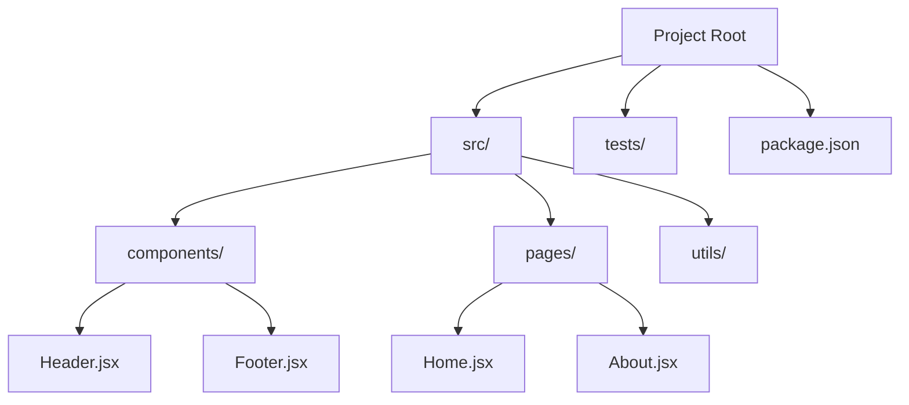

### Styling for Directory Trees
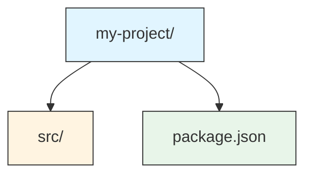

---

## Class Diagram

Use for: Data models, class relationships, database schemas, API structures

### Syntax

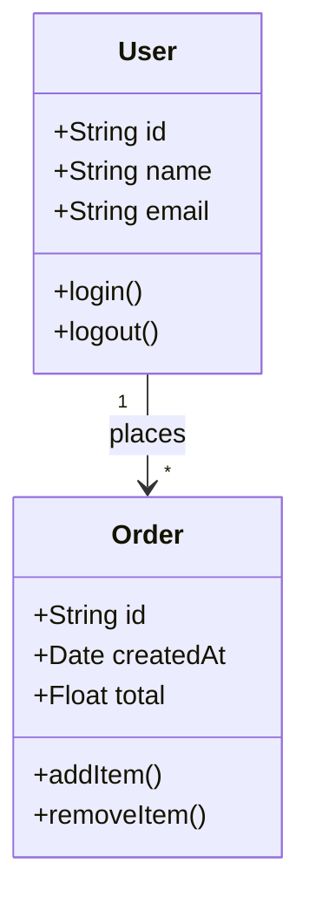

### Relationship Types
- `-->` Association
- `-->` Inheritance
- `-->` Composition
- `-->` Aggregation
- `-->` Dependency

### Example with Multiple Relationships
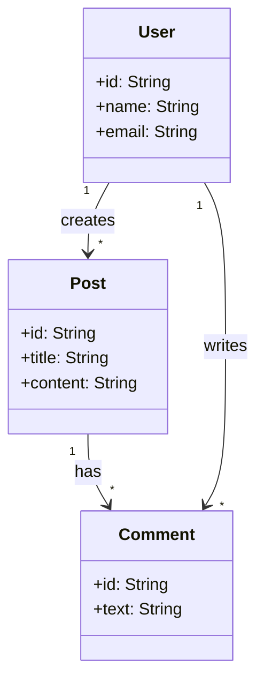

---

## State Diagram

Use for: State machines, workflow states, application lifecycles, component states

### Syntax

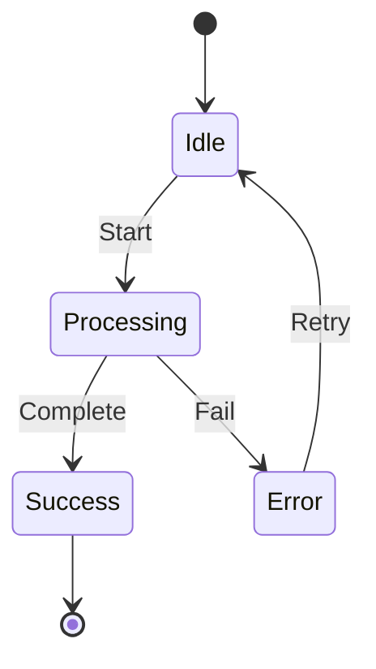

### Composite States
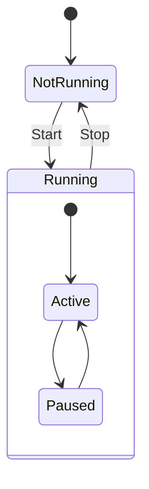

---

## Best Practices

### 1. Keep Diagrams Simple
- Avoid too many nodes (aim for < 20)
- Use clear, concise labels
- Focus on the essential flow

### 2. Use Consistent Naming
- Use verb-noun format for actions (e.g., "Load Data")
- Use noun phrases for states (e.g., "Processing")
- Be specific but not verbose

### 3. Color Coding
```mermaid
flowchart TD
    A[Start] --> B[Process]
    B --> C[End]

    %% Color scheme
    classDef start fill:#4CAF50,stroke:#333,stroke-width:2px,color:white
    classDef process fill:#2196F3,stroke:#333,stroke-width:2px,color:white
    classDef end fill:#f44336,stroke:#333,stroke-width:2px,color:white

    class A start
    class B process
    class C end
```

### 4. Use Subgraphs for Organization
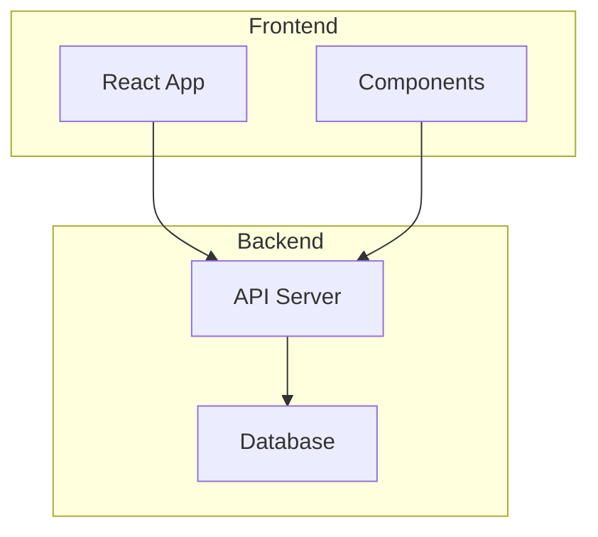

### 5. Add Legends When Needed
```
Legend:
- Solid arrows: Direct calls
- Dotted arrows: Data flow
- Green nodes: Success states
- Red nodes: Error states
```

### 6. Document Complex Flows
For complex flows, break into multiple diagrams:
1. High-level overview
2. Detailed subprocess
3. Error handling flow

---

## Common Diagrams for Codebase Analysis

### Application Architecture
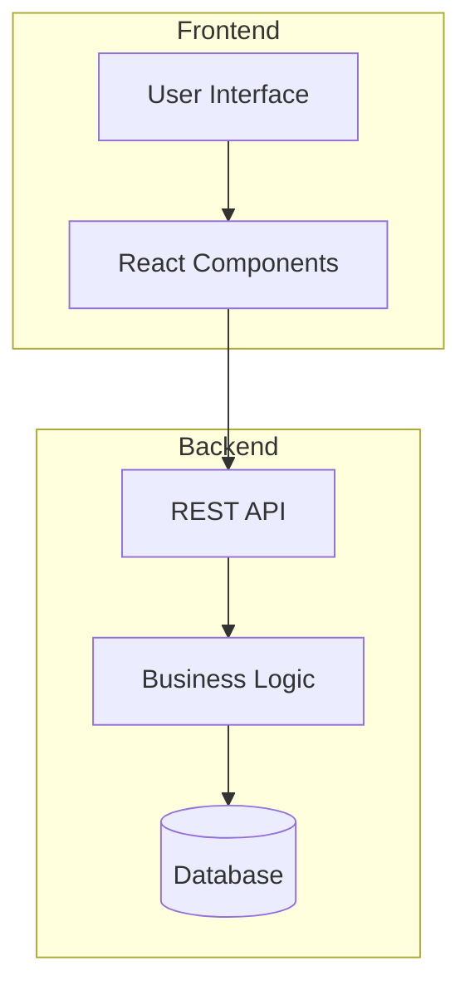

### Request Flow
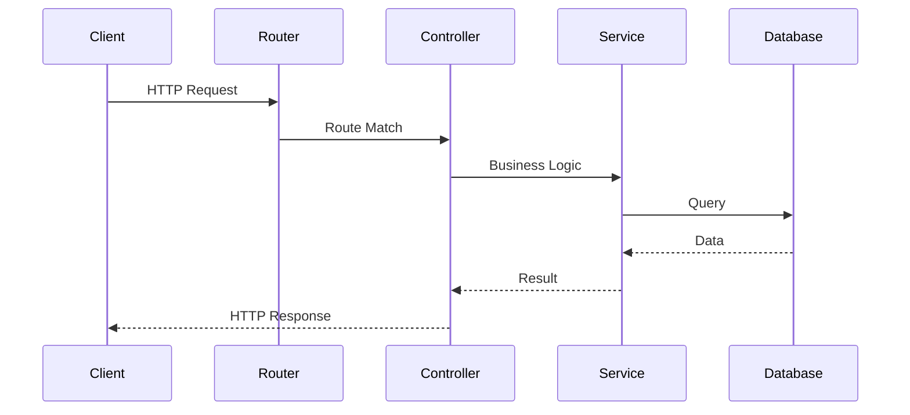

### Module Dependencies
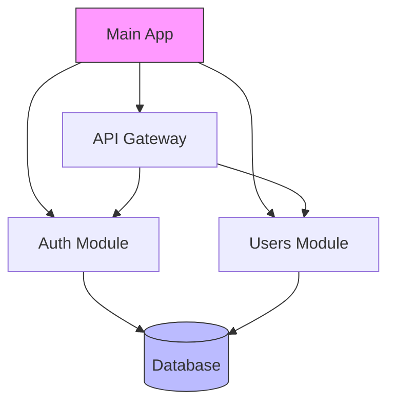

### Data Flow
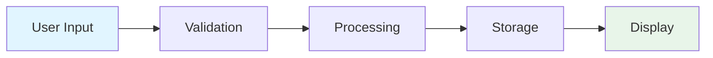

---

## Tips for Codebase Documentation

1. **Start with high-level diagrams** before diving into details
2. **Use consistent styling** across all diagrams in the document
3. **Include file paths** as labels where helpful
4. **Highlight key files** with distinctive colors
5. **Add comments** for complex logic or decisions
6. **Keep diagrams readable** - test at different zoom levels

---

## Mermaid Resources

- [Official Documentation](https://mermaid.js.org/intro/)
- [Live Editor](https://mermaid.live/)
- [Syntax Examples](https://mermaid.js.org/syntax/examples.html)
