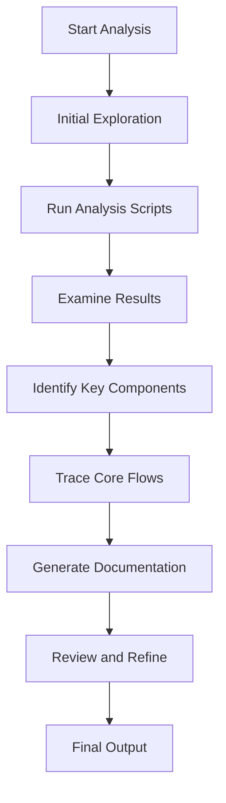

# Codebase Analysis Workflow Guide

Comprehensive guide for analyzing codebases and generating documentation.

---

## Table of Contents
- [Overview](#overview)
- [Analysis Workflow](#analysis-workflow)
- [Step-by-Step Process](#step-by-step-process)
- [Analysis Dimensions](#analysis-dimensions)
- [Project Type Strategies](#project-type-strategies)
- [Common Patterns](#common-patterns)
- [Troubleshooting](#troubleshooting)

---

## Overview

This workflow guides you through analyzing a codebase systematically to produce comprehensive documentation. The process involves:

1. **Initial Exploration** - Quick overview of project structure
2. **Deep Analysis** - Detailed examination of code and dependencies
3. **Documentation Generation** - Creating structured output with diagrams
4. **Review and Refine** - Ensuring accuracy and completeness

---

## Analysis Workflow



---

## Step-by-Step Process

### Step 1: Initial Exploration

**Goal**: Get a quick understanding of the project

**Actions**:
1. Check project root for README files
2. Identify package manager and main entry points
3. Note the primary programming language(s)
4. Look for configuration files

**Questions to Answer**:
- What is this project about?
- What are the main technologies used?
- How is the project structured?

**Duration**: 2-5 minutes

---

### Step 2: Run Analysis Scripts

**Goal**: Gather detailed technical information

**Scripts to Run**:

#### 2.1 Analyze Structure
```bash
python3 .claude/skills/codebase-explorer/scripts/analyze_structure.py [project_path] --max-depth 3
```

**Output**:
- Directory tree
- File statistics
- Mermaid tree diagram
- JSON structure data

#### 2.2 Detect Tech Stack
```bash
python3 .claude/skills/codebase-explorer/scripts/detect_tech_stack.py [project_path]
```

**Output**:
- Package manager
- Languages with file counts
- Frameworks
- Build tools
- Top dependencies

#### 2.3 Find Entry Points
```bash
python3 .claude/skills/codebase-explorer/scripts/find_entry_points.py [project_path]
```

**Output**:
- Entry point files
- Configuration files
- Route definitions
- API endpoints

**Duration**: 1-3 minutes total

---

### Step 3: Examine Results

**Goal**: Understand the technical landscape

**Actions**:
1. Review project structure output
2. Identify key directories and their purposes
3. Note the technology stack
4. List important frameworks and libraries
5. Locate entry points and configuration files

**Key Information to Extract**:
- Project type (web app, library, CLI tool, etc.)
- Architecture pattern (MVC, microservices, monolith, etc.)
- Main modules and their responsibilities
- External dependencies and integrations

**Duration**: 3-5 minutes

---

### Step 4: Identify Key Components

**Goal**: Map out the main building blocks

**Analysis Dimensions**:

#### 4.1 Identify Entry Points
- Main application entry file
- Route definition files
- Configuration files
- API endpoint definitions

#### 4.2 Identify Core Modules
- Business logic modules
- Data access layers
- Utility/helper functions
- UI components (for frontend projects)

#### 4.3 Identify Data Flow
- Where data enters the system
- How data is processed
- Where data is stored
- How data is returned

**Duration**: 5-10 minutes

---

### Step 5: Trace Core Flows

**Goal**: Understand how the application works

**Common Flows to Trace**:

#### 5.1 Application Startup Flow
1. Entry point loads
2. Configuration is read
3. Dependencies are initialized
4. Server/listeners start
5. Application is ready

#### 5.2 Request/Response Flow
1. Request enters at entry point
2. Routing determines handler
3. Middleware processes request
4. Controller/action executes
5. Business logic runs
6. Data is retrieved/stored
7. Response is generated
8. Response is returned

#### 5.3 Data Flow
1. Input validation
2. Processing/transformation
3. Business rules application
4. Persistence
5. Output formatting

**Actions**:
- Read key files identified in Step 4
- Follow function calls and imports
- Map the execution path
- Note important decisions and branches
- Identify error handling

**Duration**: 10-20 minutes (depends on complexity)

---

### Step 6: Generate Documentation

**Goal**: Create comprehensive, readable documentation

**Using the Template**:
1. Load `references/doc_template.md`
2. Fill in all sections with gathered information
3. Generate Mermaid diagrams for visual clarity
4. Ensure all placeholders are replaced

**Documentation Structure**:
1. Project Overview - High-level description
2. Tech Stack Analysis - Technologies used
3. Project Structure - Directory layout with Mermaid tree
4. Core Flows - Mermaid flowcharts and sequence diagrams
5. Module Dependencies - Mermaid dependency graph
6. Key Files - Important files and their purposes
7. Architecture Analysis - Patterns and design
8. Recommendations - Improvement suggestions

**Duration**: 10-15 minutes

---

### Step 7: Review and Refine

**Goal**: Ensure accuracy and completeness

**Checklist**:
- [ ] All placeholder text replaced
- [ ] Mermaid diagrams render correctly
- [ ] File paths are accurate
- [ ] Technology versions are correct
- [ ] Flow descriptions are clear
- [ ] Recommendations are actionable
- [ ] No technical errors or assumptions

**Actions**:
- Review each section for clarity
- Verify technical details against actual code
- Check Mermaid syntax
- Ensure consistent formatting
- Add any missing insights

**Duration**: 3-5 minutes

---

## Analysis Dimensions

### 1. Project Structure
- **What to analyze**: Directory organization, file placement, module boundaries
- **Why it matters**: Reveals architecture, separation of concerns, scalability
- **Output**: Mermaid tree diagram, directory descriptions

### 2. Technology Stack
- **What to analyze**: Languages, frameworks, libraries, tools
- **Why it matters**: Determines capabilities, constraints, best practices
- **Output**: Tech stack tables, dependency lists

### 3. Code Flows
- **What to analyze**: Execution paths, data flow, request/response cycles
- **Why it matters**: Critical for understanding how the system works
- **Output**: Mermaid flowcharts, sequence diagrams

### 4. Dependencies
- **What to analyze**: Module relationships, external integrations
- **Why it matters**: Affects maintenance, testing, deployment
- **Output**: Mermaid dependency graph, integration lists

### 5. Architecture Patterns
- **What to analyze**: Design patterns, architectural style
- **Why it matters**: Informs development practices and improvements
- **Output**: Pattern descriptions, architecture notes

---

## Project Type Strategies

### Web Applications (Full Stack)

**Focus Areas**:
- API endpoints and routes
- Frontend/backend integration
- Database models and queries
- Authentication/authorization

**Key Files**:
- Route definitions (`routes.py`, `router.js`)
- API handlers (`api/`, `controllers/`)
- Database models (`models/`, `entities/`)
- Frontend components (`components/`, `pages/`)

### Frontend Projects (React/Vue/etc.)

**Focus Areas**:
- Component hierarchy
- State management
- Routing configuration
- API integration

**Key Files**:
- Root component (`App.jsx`, `App.vue`)
- Route configuration (`router/`, `routes/`)
- State store (`store/`, `context/`)
- Main entry point (`index.js`, `main.js`)

### Backend Services

**Focus Areas**:
- API design and endpoints
- Business logic
- Data access patterns
- Middleware and authentication

**Key Files**:
- Application entry (`main.py`, `app.js`)
- API routes (`api/`, `routes/`)
- Services (`services/`)
- Models/repositories (`models/`, `repositories/`)

### Libraries / SDKs

**Focus Areas**:
- Public API surface
- Internal architecture
- Dependencies
- Usage examples

**Key Files**:
- Package entry points
- Public API definitions (`__init__.py`, `index.js`)
- Core implementation
- Examples/demo code

### CLI Tools

**Focus Areas**:
- Command definitions
- Argument parsing
- Main execution flow
- Configuration handling

**Key Files**:
- CLI entry point (`cli.py`, `cli.js`)
- Command definitions
- Main application logic

---

## Common Patterns

### MVC Pattern
```
models/      - Data structures and business rules
views/       - UI templates/components
controllers/ - Request handling and orchestration
```

### Layered Architecture
```
presentation/  - UI layer
application/   - Application logic
domain/        - Business logic
infrastructure/ - External integrations
```

### Microservices
```
service-a/
service-b/
shared/
gateway/
```

### Monolith
```
src/
├── modules/
│   ├── auth/
│   ├── users/
│   └── orders/
├── shared/
└── config/
```

---

## Troubleshooting

### Issue: Scripts Fail to Run

**Possible Causes**:
- Python not installed
- Missing permissions
- Path issues

**Solutions**:
1. Check Python installation: `python3 --version`
2. Verify script permissions: `chmod +x scripts/*.py`
3. Use absolute paths if relative paths fail

### Issue: No Dependencies Detected

**Possible Causes**:
- Uncommon package manager
- Custom build system
- Legacy project structure

**Solutions**:
1. Look for alternative dependency files
2. Check for custom build scripts
3. Analyze import statements manually
4. Note this in documentation

### Issue: Complex Project Structure

**Possible Causes**:
- Monorepo with multiple projects
- Mixed languages/frameworks
- Deep nesting

**Solutions**:
1. Focus on main application first
2. Use `--max-depth` to limit tree depth
3. Analyze sub-projects separately
4. Create separate documentation if needed

### Issue: Unclear Entry Points

**Possible Causes**:
- Multiple entry points
- Dynamic loading
- Plugin architecture

**Solutions**:
1. Check configuration files for main entry
2. Look for `main`, `index`, `app` files
3. Search for function calls like `listen()`, `run()`, `start()`
4. Document all discovered entry points

---

## Best Practices

1. **Start Simple**: Begin with quick overview, then dive deeper
2. **Use Scripts**: Let automation handle data collection
3. **Focus on Essentials**: Don't document every file, focus on key components
4. **Visualize**: Use Mermaid diagrams to make complex flows clear
5. **Be Specific**: Use actual file paths and function names
6. **Note Assumptions**: Clearly mark when you're inferring information
7. **Provide Context**: Explain why certain decisions were made
8. **Keep It Readable**: Use clear language and good formatting

---

## Time Estimates

| Project Size | Analysis Time | Documentation Time | Total |
|-------------|--------------|-------------------|-------|
| Small (< 100 files) | 10-15 min | 10-15 min | 20-30 min |
| Medium (100-500 files) | 20-30 min | 15-20 min | 35-50 min |
| Large (500+ files) | 30-60 min | 20-30 min | 50-90 min |

---

## Output Checklist

Before delivering the documentation, ensure:

- [ ] Project overview is clear and accurate
- [ ] Tech stack is complete with versions
- [ ] Directory structure is visualized with Mermaid
- [ ] Core flows are documented with diagrams
- [ ] Key files are listed with descriptions
- [ ] Architecture patterns are identified
- [ ] Recommendations are provided
- [ ] All Mermaid diagrams are valid
- [ ] File paths are correct
- [ ] No placeholder text remains
